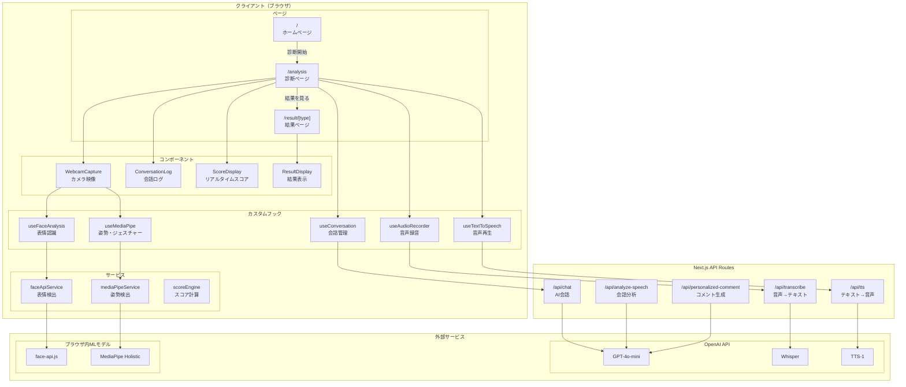
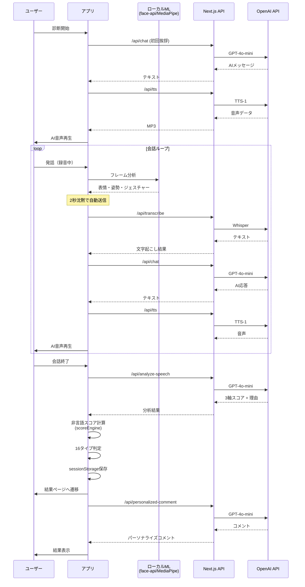
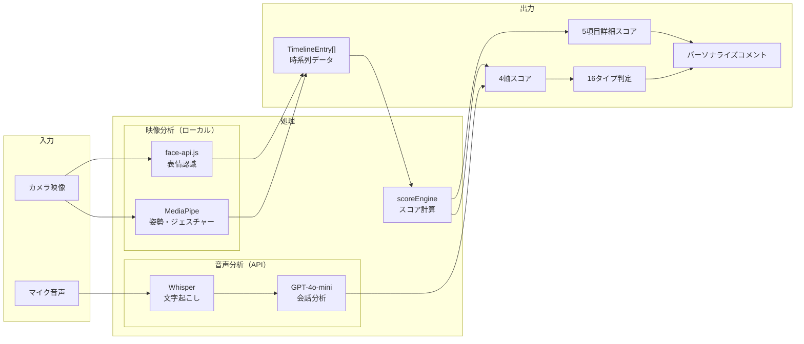
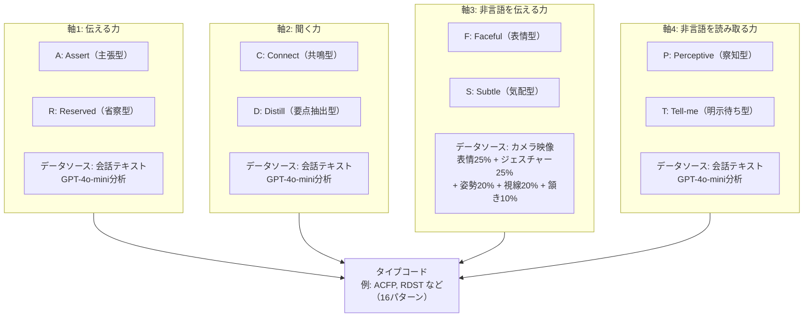
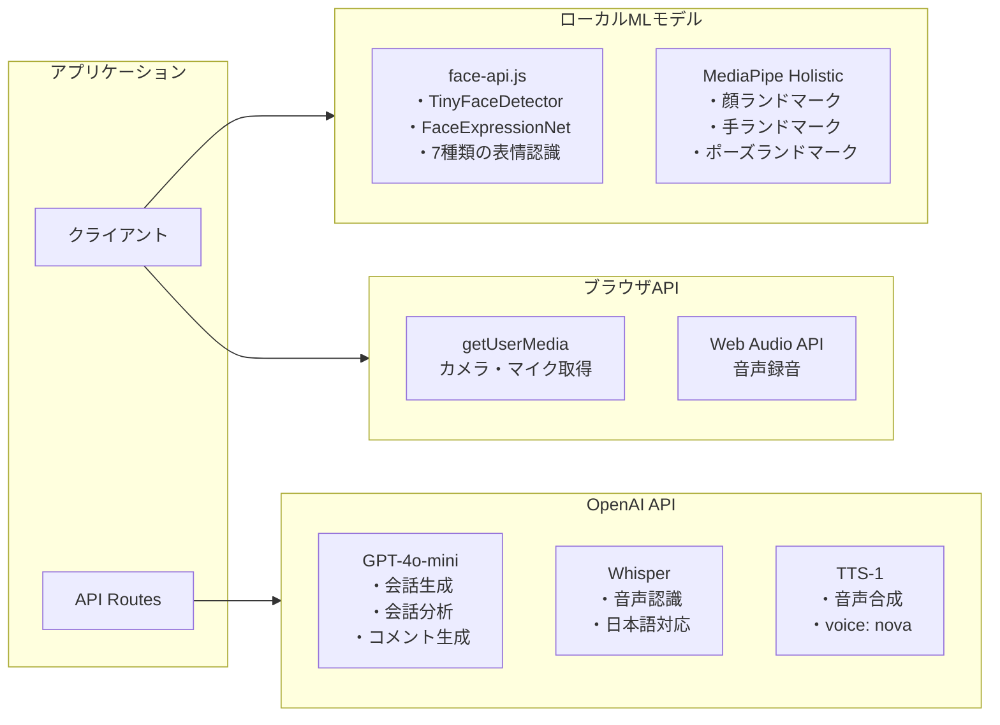

# Communication MBTI

AIとの会話を通じて、あなたのコミュニケーションスタイルを16タイプで診断するWebアプリケーションです。

## 概要

カメラとマイクを使用してAIと会話し、その間の**言語的特徴**と**非言語的特徴**をリアルタイムで分析。4つの軸で評価し、16種類のコミュニケーションタイプを判定します。

---

## システム構成図



---

## 診断フロー



---

## データフロー



---

## 4軸評価システム



---

## 外部サービス連携



---

## 技術スタック

| カテゴリ | 技術 | 用途 |
|---------|------|------|
| フレームワーク | Next.js 15 (App Router) | フルスタックReact |
| 言語 | TypeScript | 型安全性 |
| スタイル | Tailwind CSS | UIスタイリング |
| AI/ML (クラウド) | OpenAI GPT-4o-mini | 会話・分析 |
| AI/ML (クラウド) | OpenAI Whisper | 音声認識 |
| AI/ML (クラウド) | OpenAI TTS-1 | 音声合成 |
| AI/ML (ローカル) | face-api.js | 表情認識 |
| AI/ML (ローカル) | MediaPipe Holistic | 姿勢・ジェスチャー |
| メディア | react-webcam | カメラ取得 |

---

## ディレクトリ構成

```
src/
├── app/
│   ├── page.tsx              # ホームページ
│   ├── analysis/             # 診断ページ
│   ├── result/[type]/        # 結果ページ
│   └── api/
│       ├── chat/             # AI会話
│       ├── transcribe/       # 音声→テキスト
│       ├── tts/              # テキスト→音声
│       ├── analyze-speech/   # 会話分析
│       └── personalized-comment/  # コメント生成
├── components/               # UIコンポーネント
├── hooks/                    # カスタムフック
├── services/                 # サービス層
├── types/                    # 型定義
└── data/                     # 16タイプ定義
```

---

## セットアップ

### 1. 依存関係のインストール

```bash
npm install
```

### 2. 環境変数の設定

`.env.local` ファイルを作成:

```
OPENAI_API_KEY=sk-...
```

### 3. 開発サーバーの起動

```bash
npm run dev
```

[http://localhost:3000](http://localhost:3000) でアプリが起動します。

---

## デプロイ

Vercelでのデプロイを推奨:

1. GitHubにプッシュ
2. Vercelでプロジェクトをインポート
3. 環境変数 `OPENAI_API_KEY` を設定
4. 自動デプロイ
